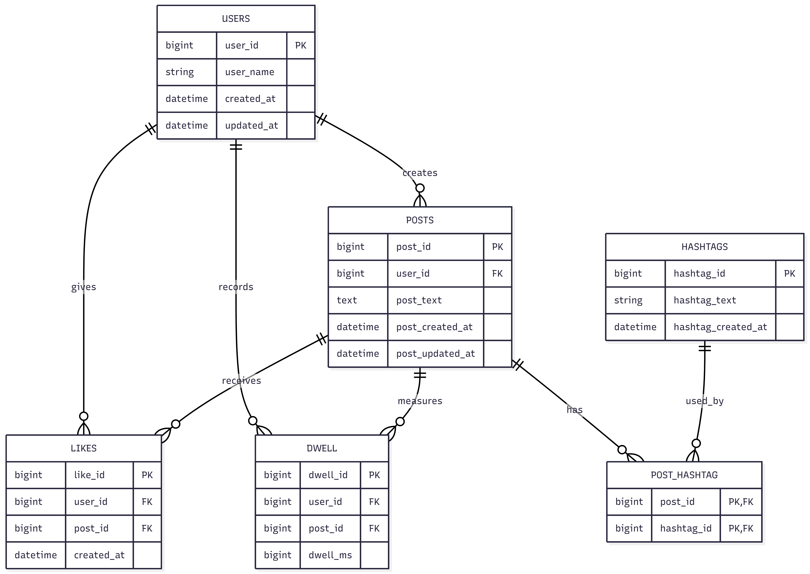

# EX603-socialmedia-database
Social Media Database Project

The following project is for BU Course EX603, building a relational model for a social media backend in Postgres.

# Domain - Social Media 
The following domain is social media to track the following five roles: users, posts, likes, hashtags and post_hashtags
# Schema 

# Query Catalogue 

# Technical Highlights 

# What I would do differently 

# Video Presentation

# How To Run IT 
