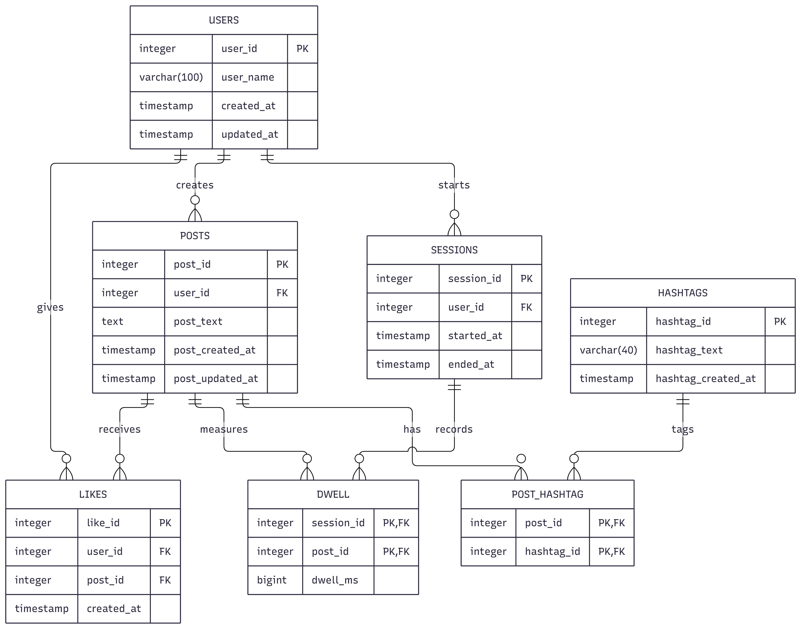

# EX603-socialmedia-database
Social Media Database Project

The following project is for BU Course EX603, building a relational model for a social media backend in Postgres.

# Domain - Social Media 
The following domain is social media to track the following five roles: users, posts, likes, hashtags and post_hashtags.The purpose of the backemnd application to store users tha create accounts by their user_id. Users can make posts and like other users posts. These posts can be associated with hashtags, and metrics can be stored about each post that each user spends dwelling on them. The structure has kept all distinct relations to add further relations such comments if they are requried if the requirements would evolve. 

The current schema represents the current strucutre which may evolve. 

The general schema for the social media relational model is described below: 

# Schema 

It was updated on 9/27/2026 to reflect sessions table addition when modeling dwell time for multiple different sessions a user might come back to a post. 
# Query Catalogue 

# Technical Highlights 

# What I would do differently 

# Video Presentation

# How To Run IT 
